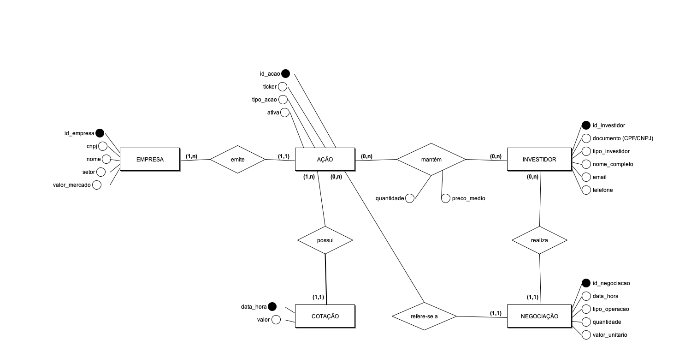

# Modelo Conceitual — Negociações na Bolsa de Valores

Notação: Entidade-Relacionamento (Peter Chen), desenhado no **brModelo 3.31**.

## Arquivos

| Arquivo | Conteúdo |
|---|---|
| `modelo_conceitual.brM3` | **Arquivo do brModelo 3** (Arquivo → Abrir). Formato nativo, versão 3.2.0 |
| `modelo_conceitual_brmodelo.png` | Print do diagrama, renderizado pelo próprio brModelo |
| `modelo_conceitual.xml` | O mesmo modelo no formato XML que o brModelo 3 também abre (fonte do `.brM3`) |
| `modelo_conceitual.md` | Este documento (descrição textual e decisões de modelagem) |

Os três arquivos são gerados por `python3 scripts/gerar_brmodelo.py` (XML) e `scripts/brmodelo/ConverteBrM3.java`
(abre o XML com as classes do brModelo e grava o `.brM3` e o PNG). Ver README.

## Entidades

| Entidade | Descrição | Atributos (identificador sublinhado) |
|---|---|---|
| **EMPRESA** | Companhia listada na bolsa | <u>id_empresa</u>, cnpj, nome, setor, valor_mercado |
| **AÇÃO** | Papel negociado, identificado pelo ticker | <u>id_acao</u>, ticker, tipo_acao, ativa |
| **INVESTIDOR** | Cliente da corretora (PF ou PJ) | <u>id_investidor</u>, documento (CPF/CNPJ), tipo_investidor, nome_completo, email, telefone |
| **NEGOCIAÇÃO** | Uma compra ou venda de uma ação por um investidor | <u>id_negociacao</u>, data_hora, tipo_operacao, quantidade, valor_unitario |
| **COTAÇÃO** *(fraca)* | Preço de uma ação em um instante | data_hora *(chave parcial)*, valor |

## Relacionamentos

| Relacionamento | Entidades | Cardinalidade (mín,máx) | Atributos |
|---|---|---|---|
| **emite** | EMPRESA — AÇÃO | EMPRESA (1,n) · AÇÃO (1,1) | — |
| **possui** *(identificador)* | AÇÃO — COTAÇÃO | AÇÃO (1,n) · COTAÇÃO (1,1) | — |
| **realiza** | INVESTIDOR — NEGOCIAÇÃO | INVESTIDOR (0,n) · NEGOCIAÇÃO (1,1) | — |
| **refere-se a** | AÇÃO — NEGOCIAÇÃO | AÇÃO (0,n) · NEGOCIAÇÃO (1,1) | — |
| **mantém (carteira)** | INVESTIDOR — AÇÃO | INVESTIDOR (0,n) · AÇÃO (0,n) | quantidade, preco_medio |

## Decisões de modelagem

1. **Negociação é entidade, não relacionamento N:N.** O enunciado diz que "um mesmo investidor pode negociar várias ações ao longo do tempo": o mesmo par (investidor, ação) ocorre muitas vezes, com data/hora, tipo, quantidade e preço próprios. Um relacionamento N:N admitiria só uma ocorrência por par. Por isso NEGOCIAÇÃO é entidade ligada a INVESTIDOR (*realiza*) e a AÇÃO (*refere-se a*), ambos 1:N.
2. **Carteira é o relacionamento N:N "mantém", com atributos.** A posição atual é única por par (investidor, ação), exatamente o que um relacionamento com atributos representa. Ela é *derivada* das negociações (regra de negócio implementada por trigger no modelo físico).
3. **Cotação é entidade fraca de Ação.** Não existe cotação sem ação e sua identificação é (ação, data_hora). O relacionamento *possui* é identificador (losango duplo).
4. **Empresa separada de Ação.** O enunciado fala em "ação pertence a uma empresa" e a mesma companhia pode ter mais de um papel (ex.: PETR3 e PETR4). Nome, setor e valor de mercado ficam na EMPRESA; o ticker fica na AÇÃO.
5. **Investidor identificado por CPF ou CNPJ.** Um único atributo `documento` guarda o CPF (PF) ou o CNPJ (PJ), qualificado por `tipo_investidor`. No físico isso vira UNIQUE + CHECK (11 ou 14 dígitos conforme o tipo).

## Como abrir e editar no brModelo

1. Baixe o brModelo 3.31 (`brModelo.jar`) em https://github.com/chcandido/brModelo/releases e execute com `java -jar brModelo.jar` (requer Java 8+).
2. *Arquivo → Abrir* e selecione `modelo_conceitual.brM3` (ou o `.xml`).
3. Entidade fraca: a ligação COTAÇÃO — *possui* está com linha dupla (propriedade *Entidade fraca* da ligação); `data_hora` está marcado como identificador (chave parcial).
4. Para gerar o modelo lógico automaticamente: *Arquivo → Converter para lógico*.
