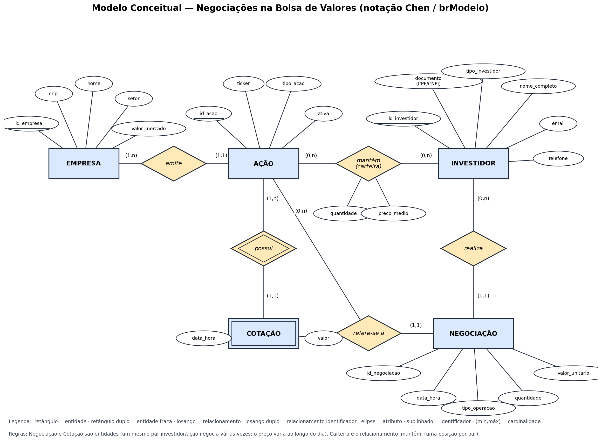

# Modelo Conceitual — Negociações na Bolsa de Valores

Notação: Entidade-Relacionamento (Peter Chen), como no BR Modelo.

## Arquivos

| Arquivo | Conteúdo |
|---|---|
| `modelo_conceitual.png` | Print do diagrama |
| `modelo_conceitual.brmodelo.json` | Modelo para importar no **brModelo Web** (app.brmodeloweb.com → *Importar*) |
| `modelo_conceitual.md` | Este documento (descrição textual + roteiro para recriar no brModelo desktop) |

## Entidades

| Entidade | Descrição | Atributos (identificador sublinhado) |
|---|---|---|
| **EMPRESA** | Companhia listada na bolsa | <u>id_empresa</u>, cnpj, nome, setor, valor_mercado |
| **AÇÃO** | Papel negociado, identificado pelo ticker | <u>id_acao</u>, ticker, tipo_acao, ativa |
| **INVESTIDOR** | Cliente da corretora (PF ou PJ) | <u>id_investidor</u>, documento (CPF/CNPJ), tipo_investidor, nome_completo, email, telefone |
| **NEGOCIAÇÃO** | Uma compra ou venda de uma ação por um investidor | <u>id_negociacao</u>, data_hora, tipo_operacao, quantidade, valor_unitario |
| **COTAÇÃO** *(fraca)* | Preço de uma ação em um instante | data_hora *(chave parcial)*, valor |

## Relacionamentos

| Relacionamento | Entidades | Cardinalidade (mín,máx) | Atributos |
|---|---|---|---|
| **emite** | EMPRESA — AÇÃO | EMPRESA (1,n) · AÇÃO (1,1) | — |
| **possui** *(identificador)* | AÇÃO — COTAÇÃO | AÇÃO (1,n) · COTAÇÃO (1,1) | — |
| **realiza** | INVESTIDOR — NEGOCIAÇÃO | INVESTIDOR (0,n) · NEGOCIAÇÃO (1,1) | — |
| **refere-se a** | AÇÃO — NEGOCIAÇÃO | AÇÃO (0,n) · NEGOCIAÇÃO (1,1) | — |
| **mantém (carteira)** | INVESTIDOR — AÇÃO | INVESTIDOR (0,n) · AÇÃO (0,n) | quantidade, preco_medio |

## Decisões de modelagem

1. **Negociação é entidade, não relacionamento N:N.** O enunciado diz que "um mesmo investidor pode negociar várias ações ao longo do tempo": o mesmo par (investidor, ação) ocorre muitas vezes, com data/hora, tipo, quantidade e preço próprios. Um relacionamento N:N admitiria só uma ocorrência por par. Por isso NEGOCIAÇÃO é entidade ligada a INVESTIDOR (*realiza*) e a AÇÃO (*refere-se a*), ambos 1:N.
2. **Carteira é o relacionamento N:N "mantém", com atributos.** A posição atual é única por par (investidor, ação), exatamente o que um relacionamento com atributos representa. Ela é *derivada* das negociações (regra de negócio implementada por trigger no modelo físico).
3. **Cotação é entidade fraca de Ação.** Não existe cotação sem ação e sua identificação é (ação, data_hora). O relacionamento *possui* é identificador (losango duplo).
4. **Empresa separada de Ação.** O enunciado fala em "ação pertence a uma empresa" e a mesma companhia pode ter mais de um papel (ex.: PETR3 e PETR4). Nome, setor e valor de mercado ficam na EMPRESA; o ticker fica na AÇÃO.
5. **Investidor identificado por CPF ou CNPJ.** Um único atributo `documento` guarda o CPF (PF) ou o CNPJ (PJ), qualificado por `tipo_investidor`. No físico isso vira UNIQUE + CHECK (11 ou 14 dígitos conforme o tipo).

## Roteiro para recriar no BR Modelo (desktop)

1. *Arquivo → Novo → Conceitual*.
2. Criar as 5 entidades (retângulo); marcar COTAÇÃO como **fraca**.
3. Criar os 5 relacionamentos (losango); marcar *possui* como **identificador**.
4. Ligar cada relacionamento às entidades e definir as cardinalidades da tabela acima (clique na linha → cardinalidade).
5. Adicionar os atributos; marcar os `id_*` como **identificador** e `data_hora` de COTAÇÃO como identificador da entidade fraca.
6. Adicionar `quantidade` e `preco_medio` ao relacionamento *mantém*.
7. Salvar como `modelo_conceitual.brM3` nesta pasta.
