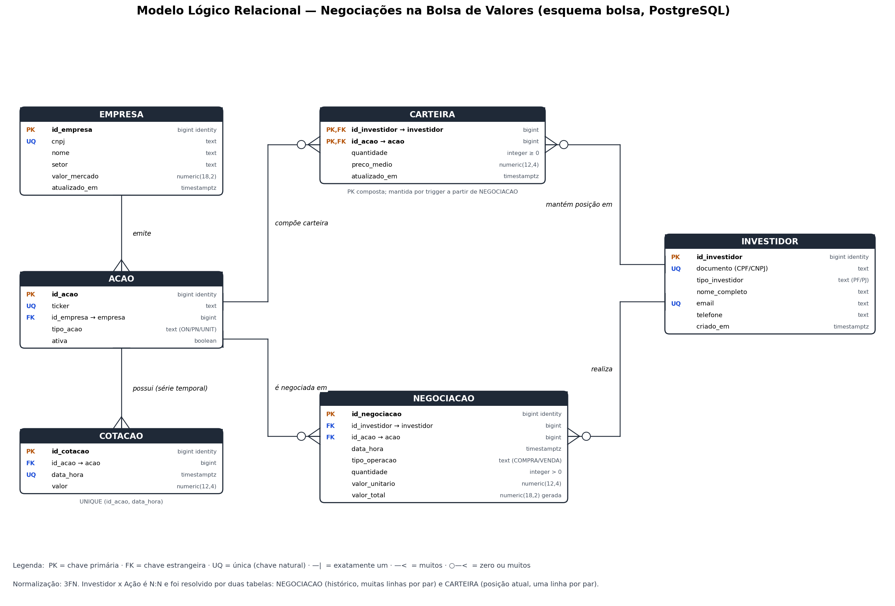

# Modelo Lógico Relacional — Negociações na Bolsa de Valores

Derivado do modelo conceitual pelas regras de mapeamento ER → relacional. Esquema: `bolsa`.



## Notação textual

```
EMPRESA    (id_empresa, cnpj, nome, setor, valor_mercado, atualizado_em)
            PK: id_empresa · UQ: cnpj

ACAO       (id_acao, ticker, id_empresa, tipo_acao, ativa)
            PK: id_acao · UQ: ticker · FK: id_empresa → EMPRESA

INVESTIDOR (id_investidor, documento, tipo_investidor, nome_completo, email, telefone, criado_em)
            PK: id_investidor · UQ: documento · UQ: email

COTACAO    (id_cotacao, id_acao, data_hora, valor)
            PK: id_cotacao · UQ: (id_acao, data_hora) · FK: id_acao → ACAO

NEGOCIACAO (id_negociacao, id_investidor, id_acao, data_hora, tipo_operacao, quantidade, valor_unitario, valor_total)
            PK: id_negociacao · FK: id_investidor → INVESTIDOR · FK: id_acao → ACAO

CARTEIRA   (id_investidor, id_acao, quantidade, preco_medio, atualizado_em)
            PK: (id_investidor, id_acao) · FK: id_investidor → INVESTIDOR · FK: id_acao → ACAO
```

## Mapeamento conceitual → lógico

| Elemento conceitual | Resultado lógico | Regra aplicada |
|---|---|---|
| Entidades EMPRESA, AÇÃO, INVESTIDOR, NEGOCIAÇÃO | Uma tabela cada, com PK substituta `id_*` | Entidade → tabela |
| *emite* (1:N) | FK `acao.id_empresa` | 1:N → FK no lado N |
| COTAÇÃO (fraca) + *possui* | Tabela `cotacao` com FK `id_acao` e UNIQUE `(id_acao, data_hora)` | Entidade fraca → herda a chave do dono; PK substituta + chave natural única |
| *realiza* e *refere-se a* (1:N) | FKs `negociacao.id_investidor` e `negociacao.id_acao` | 1:N → FK no lado N |
| *mantém* (N:N com atributos) | Tabela `carteira` com PK composta `(id_investidor, id_acao)` e os atributos do relacionamento | N:N → tabela associativa |
| Atributo derivado `valor_total` | Coluna gerada `quantidade × valor_unitario` | Derivado → calculado no SGBD |

## Dicionário de dados

### EMPRESA
| Coluna | Tipo | Restrições | Descrição |
|---|---|---|---|
| id_empresa | bigint identity | PK | Identificador |
| cnpj | text | NOT NULL, UNIQUE, 14 dígitos | CNPJ da companhia |
| nome | text | NOT NULL | Razão social / nome de pregão |
| setor | text | NOT NULL | Setor de atuação |
| valor_mercado | numeric(18,2) | NOT NULL, ≥ 0 | Capitalização de mercado (R$) |
| atualizado_em | timestamptz | NOT NULL, default now() | Última atualização cadastral |

### ACAO
| Coluna | Tipo | Restrições | Descrição |
|---|---|---|---|
| id_acao | bigint identity | PK | Identificador |
| ticker | text | NOT NULL, UNIQUE, `^[A-Z]{4}[0-9]{1,2}$` | Código de negociação |
| id_empresa | bigint | NOT NULL, FK → empresa (RESTRICT) | Emissora |
| tipo_acao | text | NOT NULL, IN (ON, PN, UNIT) | Classe do papel |
| ativa | boolean | NOT NULL, default true | Papel ainda listado |

### INVESTIDOR
| Coluna | Tipo | Restrições | Descrição |
|---|---|---|---|
| id_investidor | bigint identity | PK | Identificador |
| documento | text | NOT NULL, UNIQUE, 11 dígitos se PF / 14 se PJ | CPF ou CNPJ |
| tipo_investidor | text | NOT NULL, IN (PF, PJ) | Pessoa física ou jurídica |
| nome_completo | text | NOT NULL | Nome / razão social |
| email | text | NOT NULL, UNIQUE, formato válido | E-mail de contato |
| telefone | text | NULL, 10–11 dígitos | Telefone |
| criado_em | timestamptz | NOT NULL, default now() | Data de cadastro |

### COTACAO
| Coluna | Tipo | Restrições | Descrição |
|---|---|---|---|
| id_cotacao | bigint identity | PK | Identificador |
| id_acao | bigint | NOT NULL, FK → acao (CASCADE) | Ação cotada |
| data_hora | timestamptz | NOT NULL, UNIQUE com id_acao | Instante da cotação |
| valor | numeric(12,4) | NOT NULL, > 0 | Preço |

### NEGOCIACAO
| Coluna | Tipo | Restrições | Descrição |
|---|---|---|---|
| id_negociacao | bigint identity | PK | Identificador |
| id_investidor | bigint | NOT NULL, FK → investidor (RESTRICT) | Quem negociou |
| id_acao | bigint | NOT NULL, FK → acao (RESTRICT) | Papel negociado |
| data_hora | timestamptz | NOT NULL, default now() | Momento da transação |
| tipo_operacao | text | NOT NULL, IN (COMPRA, VENDA) | Tipo de operação |
| quantidade | integer | NOT NULL, > 0 | Ações negociadas |
| valor_unitario | numeric(12,4) | NOT NULL, > 0 | Preço no momento |
| valor_total | numeric(18,2) | gerada (quantidade × valor_unitario) | Valor financeiro |

### CARTEIRA
| Coluna | Tipo | Restrições | Descrição |
|---|---|---|---|
| id_investidor | bigint | PK, FK → investidor (CASCADE) | Dono da posição |
| id_acao | bigint | PK, FK → acao (RESTRICT) | Papel |
| quantidade | integer | NOT NULL, ≥ 0 | Ações em custódia |
| preco_medio | numeric(12,4) | NOT NULL, ≥ 0 | Custo médio de aquisição |
| atualizado_em | timestamptz | NOT NULL | Última negociação que afetou a posição |

## Normalização

- **1FN**: todos os atributos são atômicos (telefone único, documento único; nada de listas em coluna).
- **2FN**: a única PK composta é a de CARTEIRA; `quantidade`, `preco_medio` e `atualizado_em` dependem do par inteiro (investidor **e** ação).
- **3FN**: nenhum atributo depende de outro não-chave. Nome, setor e valor de mercado da empresa ficaram na EMPRESA, não na AÇÃO (evita repetir dados da companhia em cada papel). `valor_total` é derivado, mas materializado como coluna **gerada** pelo SGBD, portanto nunca fica inconsistente.

## Regras de negócio levadas ao modelo físico

| Regra | Implementação |
|---|---|
| CPF tem 11 dígitos para PF e CNPJ 14 para PJ | CHECK em `investidor` |
| Ticker único, empresa única por CNPJ | UNIQUE |
| Uma cotação por ação por instante | UNIQUE `(id_acao, data_hora)` |
| Carteira atualizada a partir das negociações | trigger `AFTER INSERT` em `negociacao` |
| Não vender mais do que se possui | validação no trigger (exceção) |
| Negociação é registro contábil, imutável | trigger que bloqueia UPDATE/DELETE |
| Análise retrospectiva pelo histórico de cotações | função `fn_carteira_em(investidor, momento)` |
